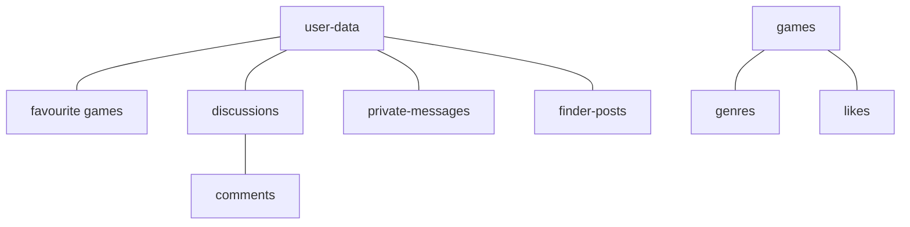

# Gamminity - Your Gaming Community 🎮

A **Gamminity** egy modern, közösségi platform gamerek számára, ahol a felhasználók felfedezhetik kedvenc játékaikat, csapattársakat kereshetnek, és diskurzust indíthatnak a legújabb gaming trendekről.

---

## a) Az alkalmazás célja 🎯

Az alkalmazás elsődleges célja egy központosított platform létrehozása a játékosok számára, amely áthidalja a szakadékot a játékinformációk keresése és a közösségi interakció között. A Gamminity nem csupán egy adatbázis, hanem egy élő közösségi tér, ahol a felhasználók:
- Valós időben kommunikálhatnak egymással.
- Véleményezhetik és rangsorolhatják a játékokat.
- Dinamikus "Finder" rendszer segítségével szinte azonnal csapattársat találhatnak.

---

## b) Funkciók és menüpontok 🛠️

Az alkalmazás letisztult, sötét tónusú "tech" designt kapott, amely minden funkciót könnyen elérhetővé tesz.

1.  **Home (Kezdőlap):** A platform kapuja, ahol a legnépszerűbb játékok és a szerver aktuális állapota látható.
    > 
2.  **Games (Játékok):** Teljes játékkatalógus szűréssel, kereséssel és Like-alapú rangsorolással.
    > 
3.  **Discussions (Fórum):** Közösségi témák indítása és megvitatása.
    > 
4.  **Finder (Csapattárskereső):** Valós idejű szobák létrehozása játékoskereséshez, létszámkorláttal és chat funkcióval.
    > 
5.  **Profile (Profil):** Személyre szabható profilkép (Cloudinary), saját kedvencek és tevékenységek kezelése.
    > 
6.  **Private Messages (Üzenetek):** Globálisan elérhető, valós idejű privát csevegőrendszer.
    > 

---

## c) Reszponzivitás és mobil megjelenés 📱

Az alkalmazás "Mobile-First" szemlélettel készült. Mobilon a navigáció egy hamburger-menübe rendeződik, a játékkártyák és a chat ablakok pedig dinamikusan alkalmazkodnak a kisebb kijelzőkhöz, biztosítva a zavartalan játékélményt útközben is.

> 
> *(Itt érdemes egy képet készíteni a telefonos nézetről, ahol a hamburger menü nyitva van)*

---

## d) Adattárolás és adatbázis felépítése 🗄️

Az alkalmazás a **Firebase Firestore** NoSQL adatbázisát használja. A logikai felépítés az alábbi gyűjteményekre (collections) épül:

- **user-data:** Felhasználói adatok, profilkép azonosítók.
- **discussions:** Fórumtémák címe és leírása.
- **private-messages:** Titkosított, valós idejű üzenetváltások.
- **games:** A rendszerben lévő játékinformációk.

---

## e) Backend architektúra és végpontok 🚀

Az alkalmazás egy dedikált Node.js/Express backendet használ a komplexebb feladatokhoz.

**Backend Repository:** [GitHub - Gamminity Backend](https://github.com/Laci5555/2026-Vizsgaremek-Backend)

### Fontosabb végpontok:

| Végpont | Metódus | Leírás | Paraméterek |
| :--- | :--- | :--- | :--- |
| `/check-email` | `POST` | Ellenőrzi az email formátumot a regisztráció előtt. | `{ email }` |
| `/welcome-email` | `POST` | Automatikus üdvözlő HTML email küldése Nodemailerrel. | `{ email, username }` |
| `/health` | `GET` | Szerver állapot monitorozás és Render keep-alive. | - |
| `/uploadPfp` | `POST` | Profilkép feltöltése Cloudinary tárhelyre. | `FormData (file)` |
| `/deleteImage` | `DELETE` | Kép törlése Cloudinary-ról public_id alapján. | `{ public_id }` |

**Hibakezelés:** A backend egységesen JSON formátumban küld hibaüzeneteket (pl. `res.status(400).send({ error: "..." })`), amelyeket a frontend a `Message` komponensen keresztül jelenít meg a felhasználónak.

---

## f) Tesztelés 🧪

A projekt magas minőségét automatizált tesztek garantálják mindkét oldalon.

### Frontend tesztelés (Vitest + React Testing Library)
A komponensek izoláltan lettek tesztelve, különös figyelmet fordítva a navigációra és a form-validációra.
- **Navbar tesztek:** Linkek és jogosultságok ellenőrzése.
- **Home tesztek:** Dinamikus tartalom és szerver státusz megjelenítés.
> 
> *(Készíts egy képernyőképet a terminálról, miután lefuttattad a pnpm test parancsot a frontend mappában)*

### Backend tesztelés (Vitest + Supertest)
A végpontok biztonságát és válaszait mock-olt környezetben teszteljük.
- **Mocking:** A Nodemailer és a Cloudinary SDK-k ki lettek váltva mock objektumokkal, így a tesztek internetkapcsolat nélkül is futtathatók.
- **Végpont tesztek:** Status code-ok és JSON válaszstruktúrák validálása.
> 
> *(Készíts egy képernyőképet a backend mappában futtatott pnpm test eredményéről)*

---

*Készítette: Laci - 2026 Vizsgaremek*
