<p align="center">
  
  
  
  
  
</p>

<h1 align="center">🎮 Gamminity</h1>
<p align="center"><i>Fedezd fel, értékeld és beszéld meg kedvenc játékaidat — egy helyen.</i></p>

---

## 📖 Tartalomjegyzék

- [a) Az alkalmazás célja](#a-az-alkalmazás-célja)
- [b) Funkciók és menüpontok](#b-funkciók-és-menüpontok)
- [c) Reszponzív megjelenés](#c-reszponzív-megjelenés)
- [d) Adattárolás](#d-adattárolás)
- [e) Backend végpontok](#e-backend-végpontok)
- [f) Tesztelés](#f-tesztelés)

---

## a) Az alkalmazás célja

A **Gamminity** egy modern, sötét témájú közösségi webalkalmazás gamerek számára. A platform célja, hogy egyetlen helyre összpontosítsa mindazt, amire egy játékosnak szüksége van:

| Probléma | Gamminity megoldása |
|---|---|
| Nehéz releváns játékokat találni | Kategorizált játékkatalógus szűréssel és kereséssel |
| Nincs hova véleményt írni | Értékelési és like/dislike rendszer minden játékhoz |
| Nehéz csapattársakat találni | **Finder** — valós idejű lobby-rendszer beépített chattel |
| Szétszórt kommunikáció | Privát üzenetküldés és fórumrendszer egy helyen |

Az alkalmazás a **Firebase** ökoszisztémára épül (hitelesítés, adatbázis), kiegészítve egy **Node.js/Express** backenddel a képfeltöltés, email-küldés és rendszermonitorozás kezelésére.

---

## b) Funkciók és menüpontok

### 🏠 Home (Kezdőlap)

A kezdőlap a platform belépési pontja. Tartalmazza:
- **Hero szekció** — animált háttér, bemutatkozó szöveg, CTA gombok
- **Szerver státusz jelvény** — valós időben jelzi a backend állapotát (`All Systems Operational` / `Service Currently Unavailable`)
- **Legutóbb hozzáadott játékok** — vízszintesen görgethető kártyák
- **CTA szekciók** — a Finder, Discussions és FAQ felé irányítanak

<!-- 📸 KÉPERNYŐKÉP: A Home oldal hero szekciója a szerver státusszal -->
> 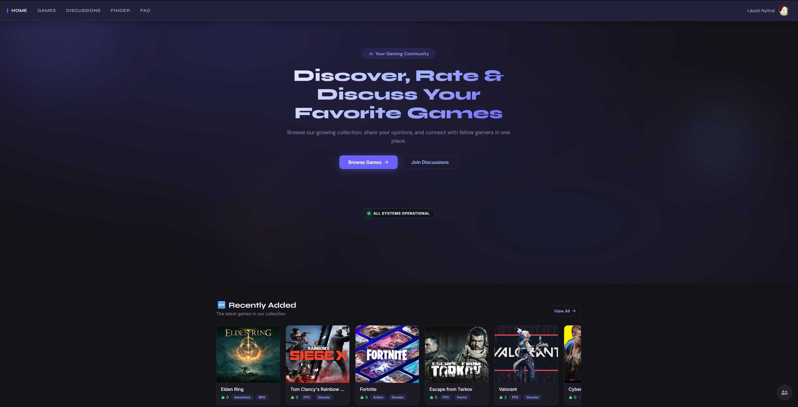

---

### 🎮 Games (Játékok)

A teljes játékkatalógus, fejlett szűrési és rendezési lehetőségekkel:
- **Keresés** — valós idejű szöveges keresés név alapján
- **Műfaj szűrő** — többszörös genre kiválasztása
- **Rendezés** — legújabb, legrégebbi, legtöbb like, ABC sorrend
- **Játék részletek** — kattintásra megnyíló modal: leírás, kép, értékelések, like/dislike
- **Új játék kérése** — felhasználók új játékot javasolhatnak az adminnak
- **Admin funkciók** — játékok hozzáadása/szerkesztése/törlése képfeltöltéssel

<!-- 📸 KÉPERNYŐKÉP: A játéklista szűrőkkel -->
> 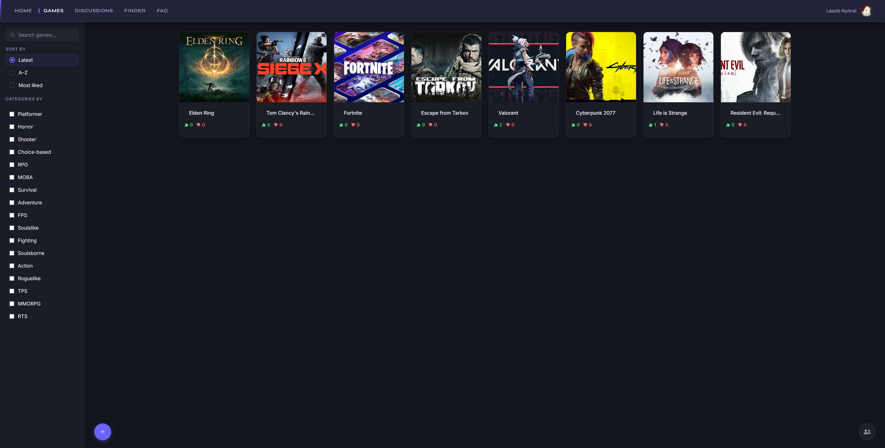

<!-- 📸 KÉPERNYŐKÉP: Egy játék részletes nézete (modal) -->
> 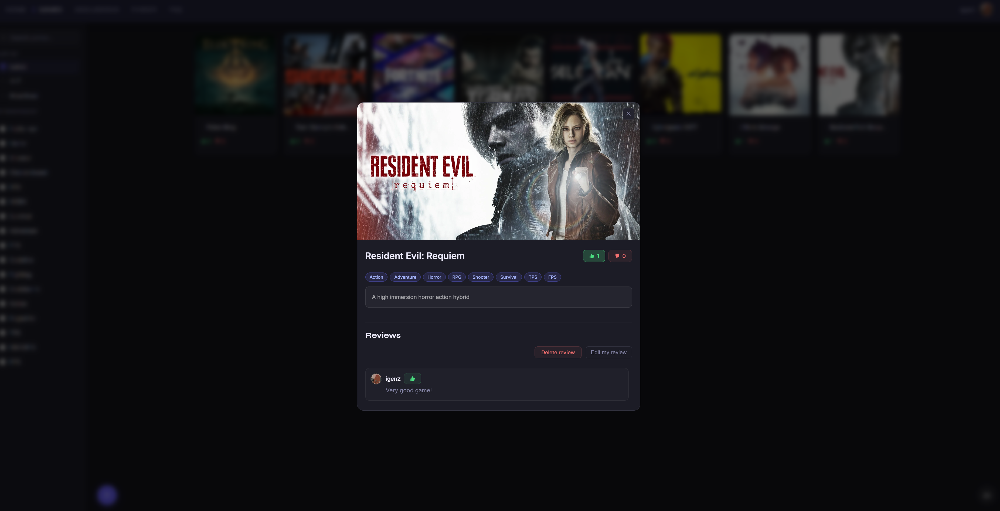

---

### 💬 Discussions (Fórum)

Közösségi fórum, ahol bármely bejelentkezett felhasználó új témát indíthat:
- **Téma létrehozása** — cím (kötelező) és opcionális leírás megadásával
- **Hozzászólások** — minden témához valós idejű kommentszekció
- **Felhasználói profil megjelenítés** — profilkép és felhasználónév a kártyákon

<!-- 📸 KÉPERNYŐKÉP: A Discussions lista és egy megnyitott téma -->
> 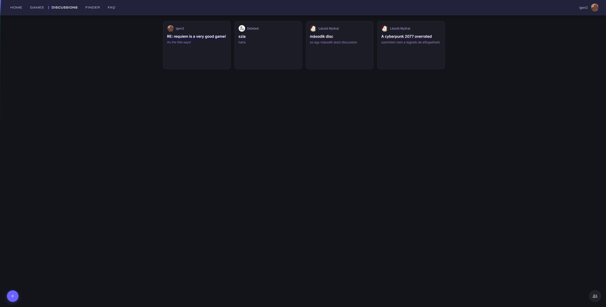

---

### 🔍 Finder (Csapattárskereső)

Egy egyedi funkció, amellyel a játékosok valós időben kereshetnek társakat:
- **Lobby létrehozása** — játék kiválasztása, leírás, opcionális létszámkorlát
- **Valós idejű chat** — a szobán belül a tagok azonnal kommunikálhatnak (Firebase `onSnapshot`)
- **Tagkezelés** — a szoba létrehozója kirúghat inaktív tagokat
- **Státusz jelzés** — `FULL` felirat, ha a szoba megtelt

<!-- 📸 KÉPERNYŐKÉP: A Finder lobbik listája és egy megnyitott szoba chattel -->
> 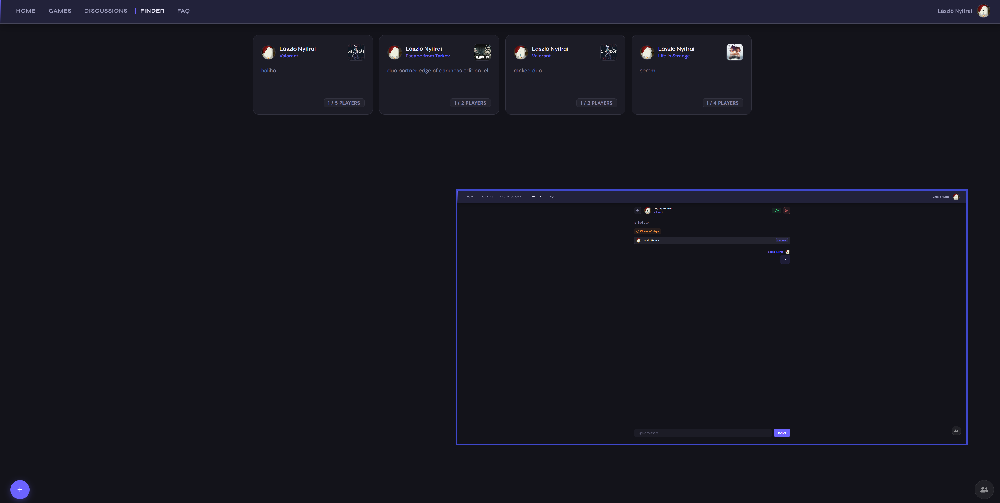

---

### 👤 Profile (Profil)

Személyre szabható profil négy füllel:

| Fül | Funkció |
|---|---|
| **Favourite Games** | Kedvenc játékok hozzáadása/eltávolítása a katalógusból |
| **My Discussions** | Saját témák szerkesztése, törlése |
| **Peoples** | *(Admin)* Felhasználók listája és kezelése |
| **My Profile** | Felhasználónév és profilkép módosítása (URL vagy fájlfeltöltés) |

<!-- 📸 KÉPERNYŐKÉP: A profil oldal a fülek egyikével -->
> 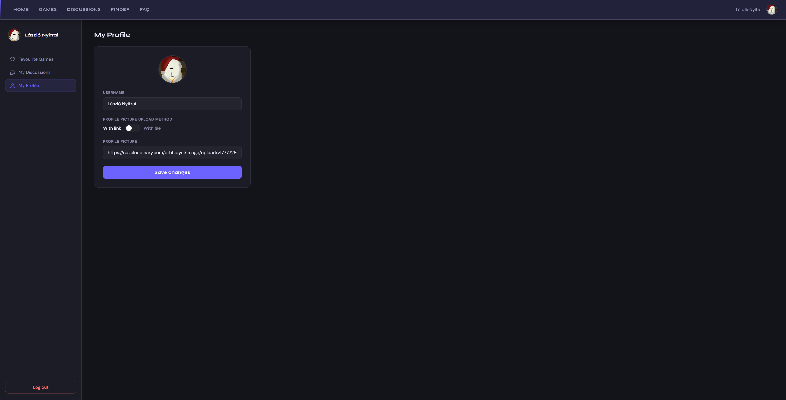

---

### ✉️ Private Messages (Privát üzenetek)

Globálisan elérhető chat rendszer, amely a képernyő jobb alsó sarkában lebeg:
- **Direct Messages** — korábbi beszélgetések listája, legfrissebb felül
- **Others** — új beszélgetés indítása bármely felhasználóval
- **Olvasatlan jelzés** — piros badge a még nem látott üzenetekről
- **Valós idejű** — Firebase `onSnapshot` listener, azonnal megjelenik az új üzenet

<!-- 📸 KÉPERNYŐKÉP: A megnyitott chat ablak egy beszélgetéssel -->
> 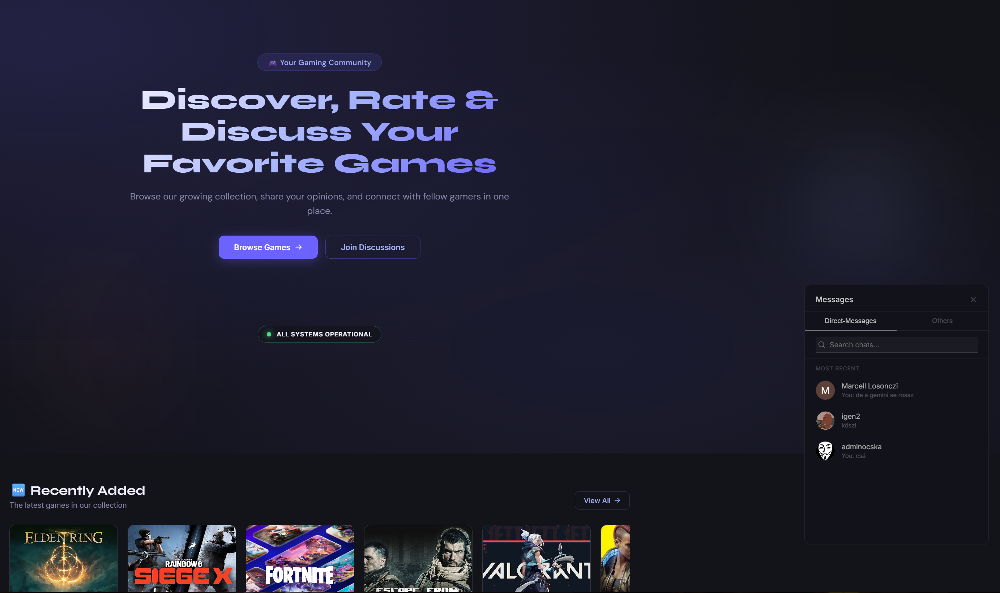

---

### ❓ FAQ (Gyakran Ismételt Kérdések)

Accordion stílusú segédoldal 10 kérdéssel a platform használatáról (pl. Finder működése, kedvencek hozzáadása, jelszókezelés).

---

### 🔐 Login / Signup (Bejelentkezés / Regisztráció)

- **Email + jelszó** alapú regisztráció és bejelentkezés (Firebase Auth)
- **Google bejelentkezés** — egykattintásos belépés Google fiókkal
- **Email validáció** — a backend ellenőrzi a formátumot regisztráció előtt
- **Üdvözlő email** — sikeres regisztrációnál automatikus, stílusos HTML levél (Nodemailer)

<!-- 📸 KÉPERNYŐKÉP: A Login oldal -->
> 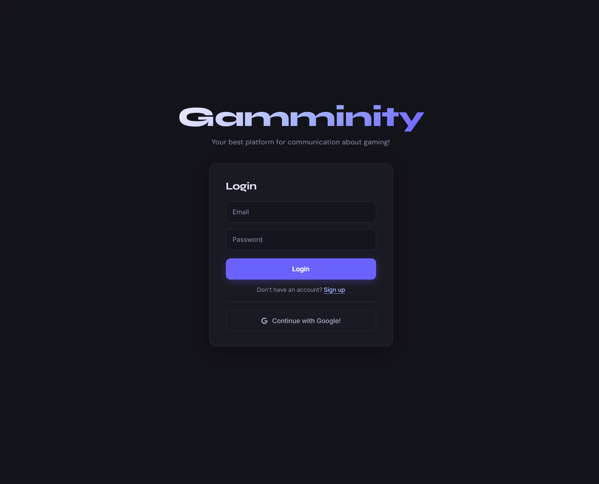

---

### 🛡️ Admin felület

Csak admin jogosultságú felhasználók számára elérhető:
- Új játékok hozzáadása képpel, műfajokkal, leírással
- Új műfajok létrehozása
- Játék-kérések (game requests) jóváhagyása vagy elutasítása
- Felhasználók kezelése a Profile → Peoples fülön

---

## c) Reszponzív megjelenés

Az alkalmazás **mobile-first** szemlélettel készült. A felhasználói felület CSS media query-k segítségével dinamikusan alkalmazkodik a képernyőmérethez.

### Főbb különbségek mobilon:

| Elem | Desktop | Mobil |
|---|---|---|
| **Navigáció** | Vízszintes menüsor | Hamburger menü (☰) lenyíló listával |
| **Játékkártyák** | Több oszlopos grid | Egy oszlopos, teljes szélességű lista |
| **Chat ablak** | Lebegő ablak a sarokban | Teljes képernyős megjelenés |
| **Finder lobbik** | Kétoszlopos elrendezés | Egymás alatti kártyák |
| **Modálok** | Középre igazított popup | Teljes szélességű alsó lap |

<!-- 📸 KÉPERNYŐKÉP: A mobil nézet – hamburger menü nyitva -->
> 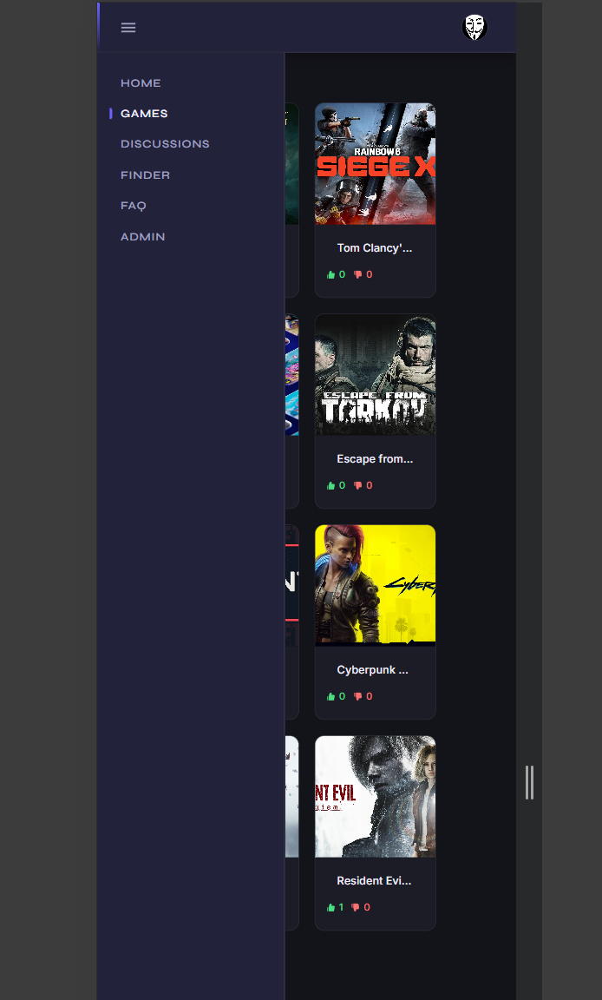

<!-- 📸 KÉPERNYŐKÉP: A mobil nézet – játékok listája -->
> 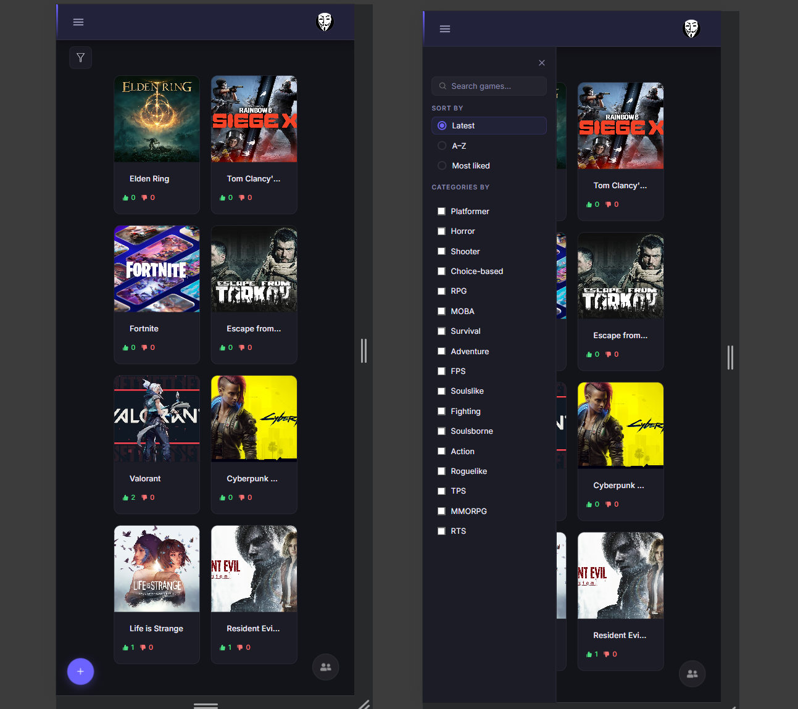

<!-- 📸 KÉPERNYŐKÉP: A mobil nézet – chat ablak -->
> 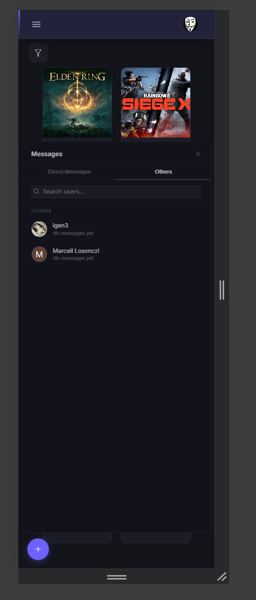

---

## d) Adattárolás

Az alkalmazás a **Google Firebase Firestore** NoSQL felhőadatbázisát használja, kiegészítve a **Cloudinary** CDN-nel a képek tárolásához.

### Firestore gyűjtemények (collections) és kapcsolataik

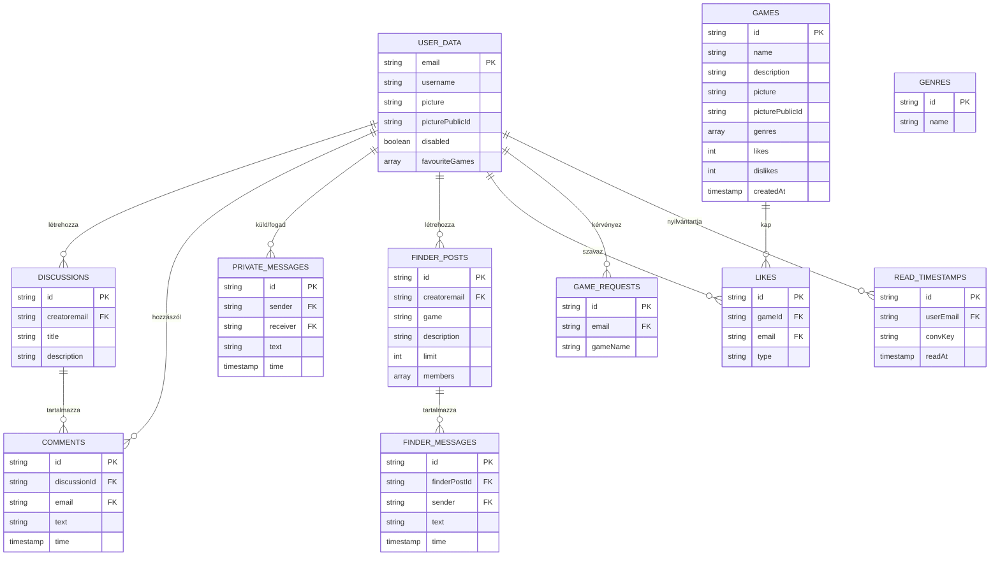

### Képtárolás

A felhasználói profilképek és játékborítóképek a **Cloudinary** felhőszolgáltatáson keresztül töltődnek fel. A Firestore-ban csak a kép URL-je (`picture`) és a törléshez szükséges azonosító (`picturePublicId`) kerül mentésre.

---

## e) Backend végpontok

A backend egy **Node.js + Express** szerver, amely a képfeltöltést, email-küldést és rendszermonitorozást kezeli.

> 🔗 **Backend repository:** [github.com/Laci5555/2026-Vizsgaremek-Backend](https://github.com/Laci5555/2026-Vizsgaremek-Backend)

### Képfeltöltés (Cloudinary)

#### `POST /uploadFile`
Játékborítókép feltöltése a Cloudinary `gameImages` mappájába.

| Paraméter | Típus | Leírás |
|---|---|---|
| `file` | `FormData` | A feltöltendő képfájl (multipart) |

**Válaszok:**
| Kód | Válasz | Leírás |
|---|---|---|
| `201` | `{ url, public_id }` | Sikeres feltöltés, visszaadja a Cloudinary URL-t |
| `400` | `{ msg: "Error missing file" }` | Nem lett fájl csatolva |
| `500` | `{ error: "..." }` | Cloudinary vagy szerverhiba |

---

#### `POST /uploadPfp`
Profilkép feltöltése a Cloudinary `profilePictures` mappájába. Működése megegyezik a `/uploadFile`-lal, de más célmappába tölt fel.

| Kód | Válasz | Leírás |
|---|---|---|
| `201` | `{ url, public_id }` | Sikeres feltöltés |
| `400` | `{ msg: "Error missing file" }` | Hiányzó fájl |

---

#### `DELETE /deleteImage`
Kép törlése a Cloudinary-ról a `public_id` alapján.

| Paraméter | Típus | Leírás |
|---|---|---|
| `public_id` | `string` | A Cloudinary által adott azonosító |

| Kód | Válasz | Leírás |
|---|---|---|
| `200` | `{ msg: "Succesful Deletion!" }` | Sikeres törlés |
| `400` | `{ msg: "Image not found" }` | Hiányzó `public_id` |

---

### Email szolgáltatások

#### `POST /check-email`
Regisztráció előtti email-formátum ellenőrzés regex segítségével.

| Paraméter | Típus | Leírás |
|---|---|---|
| `email` | `string` | Az ellenőrizendő email cím |

| Kód | Válasz | Leírás |
|---|---|---|
| `200` | `{ valid: true }` | Érvényes email formátum |
| `400` | `{ valid: false, message: "..." }` | Érvénytelen formátum |
| `400` | `{ error: "Email is required" }` | Hiányzó email mező |

---

#### `POST /welcome-email`
Automatikus üdvözlő email küldése regisztráció után (Nodemailer + Gmail SMTP). A levél egy stílusos, HTML formátumú sablon a Gamminity arculatával.

| Paraméter | Típus | Leírás |
|---|---|---|
| `email` | `string` | A címzett email címe |
| `username` | `string` | A felhasználó választott neve |

| Kód | Válasz | Leírás |
|---|---|---|
| `200` | `{ msg: "Welcome email sent successfully" }` | Sikeres küldés |
| `400` | `{ error: "Email and username are required" }` | Hiányzó adatok |
| `500` | `{ error: "Failed to send welcome email" }` | SMTP hiba |

---

### Rendszer monitorozás

#### `GET /health`
Szerver állapot lekérdezése. A frontend 30 másodpercenként kérdezi le, ami egyrészt vizuális státuszt biztosít, másrészt „keep-alive" funkcióként megakadályozza, hogy az ingyenes hosting (pl. Render) elaltatja a szervert.

| Kód | Válasz | Leírás |
|---|---|---|
| `200` | `{ status: "online", uptime: 12345, timestamp: "..." }` | A szerver fut |

---

## f) Tesztelés

Mind a frontend, mind a backend automatizált tesztekkel rendelkezik.

### Frontend tesztek

**Technológia:** Vitest + React Testing Library + jsdom

A tesztek a `tests/` mappában találhatók. Összesen **11 tesztfájl, 23 teszteset**, amelyek minden oldal renderelését és a legfontosabb interakciókat ellenőrzik.

| Tesztfájl | Mit tesztel |
|---|---|
| `Navbar.test.jsx` | Navigációs linkek megjelenése, admin link, kattintásra navigáció |
| `Home.test.jsx` | Hero szekció renderelése, FAQ gombra navigáció |
| `Games.test.jsx` | Játéklista renderelése, kereső megjelenése |
| `Login.test.jsx` | Bejelentkezési űrlap, email/jelszó mezők kitöltése |
| `Profile.test.jsx` | Profil fülek megjelenése, felhasználói adatok |
| `Discussions.test.jsx` | Fórumlista megjelenése, új téma gomb |
| `Discussion.test.jsx` | Egyedi téma renderelése, kommentek |
| `Finder.test.jsx` | Finder lobbik listája |
| `Faq.test.jsx` | FAQ accordion megnyitása/zárása |
| `Admin.test.jsx` | Admin felület renderelése |
| `Message.test.jsx` | Chat rendszer megjelenése |

**Futtatás:**
```bash
cd 2026-Vizsgaremek-Frontend
pnpm test
```

> 💡 **Tipp:** A `tests/run_tests.bat` fájl dupla kattintással is futtatható — automatikusan lefuttatja az összes tesztet, nincs szükség parancssori ismeretekre.

<!-- 📸 KÉPERNYŐKÉP: A frontend tesztek sikeres futtatása a terminálban (pnpm test) -->
> 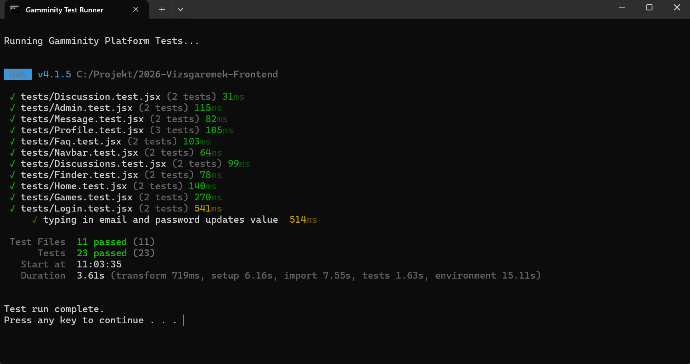

---

### Backend tesztek

**Technológia:** Vitest + Supertest

A tesztek a `tests/endpoints.test.js` fájlban találhatók. A **Cloudinary** és a **Nodemailer** mock-olva van, így a tesztek külső szolgáltatások nélkül is futtathatók.

| Teszt | Mit ellenőriz |
|---|---|
| `GET /health` | 200-as válaszkód, `status: "online"` mező |
| `POST /check-email` (valid) | 200-as válasz, `valid: true` |
| `POST /uploadFile` | 201-es válasz, Cloudinary URL és public_id visszaadása |
| `POST /uploadFile` (no file) | 400-as hiba, `"Error missing file"` üzenet |
| `POST /uploadPfp` | 201-es válasz, sikeres profilkép feltöltés |
| `DELETE /deleteImage` | 200-as válasz, `"Succesful Deletion!"` |
| `POST /welcome-email` | 200-as válasz, mock-olt email küldés |

**Futtatás:**
```bash
cd 2026-Vizsgaremek-Backend
pnpm test
```

> 💡 **Tipp:** A `tests/run_tests.bat` fájl dupla kattintással is futtatható — automatikusan lefuttatja az összes tesztet, nincs szükség parancssori ismeretekre.

<!-- 📸 KÉPERNYŐKÉP: A backend tesztek sikeres futtatása a terminálban (pnpm test) -->
> 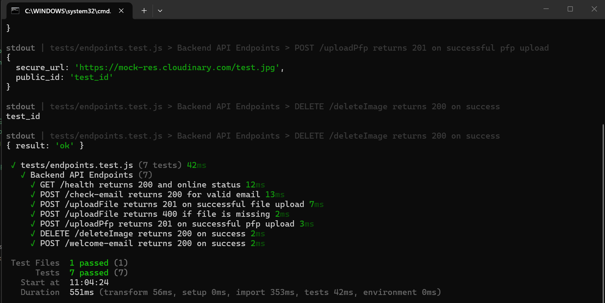

---

<p align="center">
  <b>Gamminity</b> — 2026 Vizsgaremek
</p>
